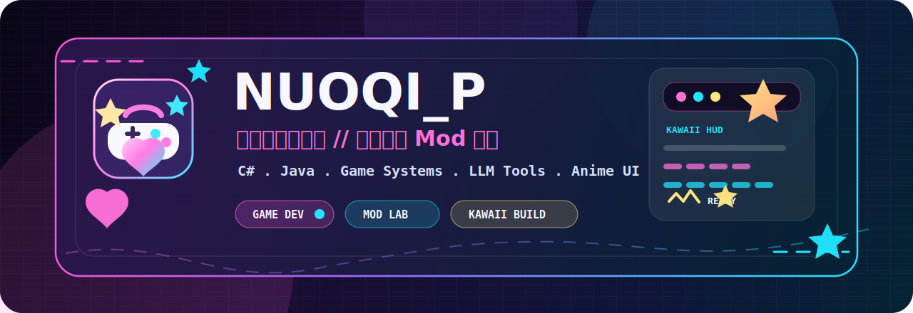

<div align="center">



# NUOQI_P

**中文游戏开发者 / Mod Creator / 二次元风格工具匠人**


<br />

<a href="https://github.com/NUOQIP">
  
</a>
<a href="https://github.com/NUOQIP?tab=followers">
  
</a>
<a href="https://github.com/NUOQIP?tab=repositories">
  
</a>

<br />
<br />


</div>

## 角色档案

我是 **NUOQI_P**，一名中文游戏开发者。<br />
我喜欢把游戏系统、Mod 工具、AI 辅助创作和二次元视觉揉在一起，做出能让玩家真正拿来玩的东西。

```txt
身份        中文游戏开发者
专精        游戏 Mod / 创作者工具 / 玩法系统 / 二次元 UI
主语言      C# / Java
当前方向    RimWorld 对话风格扩展、Slay the Spire 卡图自定义
目标        做出有个性、好用、能被玩家记住的游戏工具
```

<div align="center">


</div>

## 能量条

<div align="center">


</div>

## 代表作

| 项目 | 亮点 | 技术栈 |
| --- | --- | --- |
| [RimTalk StyleExpand](https://github.com/NUOQIP/RimtalkStyleExpand) | 为 RimTalk 扩展“文风系统”：语义切分、向量检索、LLM 分析、Prompt 注入，让游戏对话拥有自定义写作风格。 | C# / RimWorld / LLM / Embedding |
| [DIY the Spire](https://github.com/NUOQIP/DIY_the_Spire) | 《杀戮尖塔》卡图自定义 Mod：支持普通版/升级版卡图、遮罩、卡包管理和即时切换。 | Java / ModTheSpire / BaseMod |

<div align="center">

<a href="https://github.com/NUOQIP/RimtalkStyleExpand">
  
</a>
<a href="https://github.com/NUOQIP/DIY_the_Spire">
  
</a>

</div>

## 开发者面板

<div align="center">


<br />


</div>

## 活动轨迹

<div align="center">


</div>

## 成就展柜

<div align="center">


</div>

## 开发信条

```txt
游戏要有灵魂。
工具要让创作变快。
界面要让人想点开。
玩家感受到的每一秒，都值得认真设计。
```

<div align="center">


</div>
