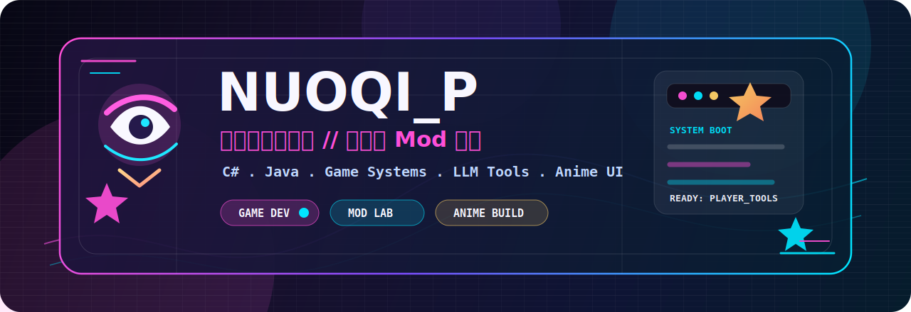

<!--
Profile setup:
Create a public repository named NUOQIP, then place this README.md at the root
and keep assets/nuoqip-anime-banner.svg in the assets folder.
-->

<div align="center">



# NUOQI_P

**Game Developer / Mod Creator / Anime-Aesthetic Builder**


<br />

<a href="https://github.com/NUOQIP">
  
</a>
<a href="https://github.com/NUOQIP?tab=followers">
  
</a>
<a href="https://github.com/NUOQIP?tab=repositories">
  
</a>

</div>

## About

I build game experiences, modding tools, and creative systems that make games feel more personal.

- Game developer focused on playful systems, modding workflows, and player-facing creativity.
- Currently building with C# and Java through RimWorld and Slay the Spire mod projects.
- Interested in LLM-assisted storytelling, vector retrieval, custom card art, and anime-inspired UI polish.
- I like tools that feel small, sharp, responsive, and a little magical.

## Current Save File

```txt
Class       Game Developer
Subclass    Mod Creator
Main Quest  Build expressive game systems and creator tools
Side Quest  Add anime-level polish to everything worth showing
Loadout     C# / Java / Game Mods / LLM Tools / UI Details
```

## Tech Loadout

<div align="center">


</div>

## Featured Projects

| Project | What it is | Stack |
| --- | --- | --- |
| [RimTalk StyleExpand](https://github.com/NUOQIP/RimtalkStyleExpand) | A RimTalk style-expansion module that uses semantic chunking, embeddings, retrieval, and prompt injection to let game dialogue follow custom writing styles. | C# / RimWorld / LLM / Embeddings |
| [DIY the Spire](https://github.com/NUOQIP/DIY_the_Spire) | A Slay the Spire card-art customization mod with in-game image selection, card masks, pack management, and instant switching. | Java / ModTheSpire / BaseMod |

<div align="center">

<a href="https://github.com/NUOQIP/RimtalkStyleExpand">
  
</a>
<a href="https://github.com/NUOQIP/DIY_the_Spire">
  
</a>

</div>

## GitHub Dashboard

<div align="center">


<br />


</div>

## Achievement Board

<div align="center">


</div>

## Dev Notes

```txt
Good games feel alive.
Good tools make creation faster.
Good UI has a soul.
```

<div align="center">

<sub>Thanks for visiting. May your build pass, your ideas land, and your profile look excellent.</sub>

</div>
