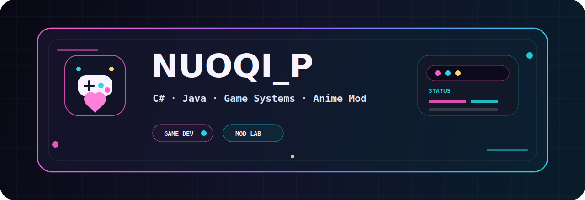

# NUOQI_P

**游戏开发者/MOD开发者/二次元爱好者**

 

 
 

## 简介

我是 **NUOQI_P**，一名中国游戏开发者，现就职于游戏行业。 
涩涩是我的信仰，终极理想是为玩家提供高质量&高淫商的涩涩二次元MOD和小黄油❤️

## 能量条

## 代表作

| 项目 | 亮点 | 技术栈 |
| --- | --- | --- |
| [RimTalk StyleExpand](https://github.com/NUOQIP/RimtalkStyleExpand) | 为 RimTalk 扩展“文风系统”：语义切分、向量检索、LLM 分析、Prompt 注入，让游戏对话拥有自定义写作风格。 | C# / RimWorld / LLM / Embedding |
| [DIY the Spire](https://github.com/NUOQIP/DIY_the_Spire) | 《杀戮尖塔》卡图自定义 Mod：支持普通版/升级版卡图、遮罩、卡包管理和即时切换。 | Java / ModTheSpire / BaseMod |

 
 

